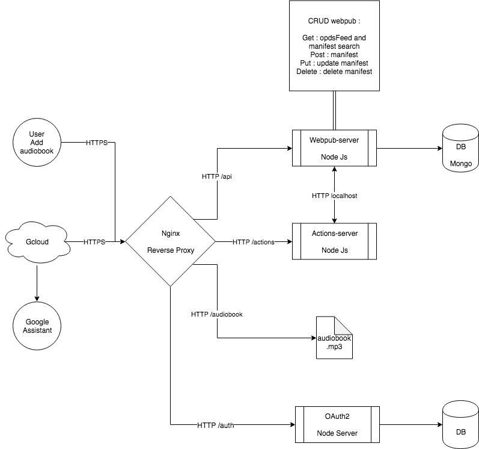

# BookAssistant

-----

DEPRECATED : see https://github.com/panaC/audiobooks

-----

The aim project is an audiobook reader developpement at destination of an visually impaired association.
Based on Google Assistant with [Google Actions](https://developers.google.com/actions/) and [Diagflow](https://dialogflow.com/)

## What's included

 - `webpub-server` - an API server that handle web request and provide opds standard audiobook
 - `agent-dialogflow` - an [agent](https://dialogflow.com/docs/agents) for Dialogflow
 - `actions-server` - an API server to parse and react to the Dialogflow agent's webhook
 - `docs` - a few documentation
 - `demo` - script for loading demo audiobook inside `webpub-server`
 - `ops` - operation part of devops. server build installation
 
## What you'll need

On the hardware side, you will need:
 - A root access server with Ubuntu LTS18
 - a [Google Home](https://madeby.google.com/home/) (or another device running Google Assistant)
 
On the software side, you will need:
 - An database, at least MongoDB
 - An nginx reverse-proxy server
 - May be an elastic-search
 
You'll also need accounts with:

- [Google](https://myaccount.google.com/intro) (the basis)
- [Dialogflow](https://dialogflow.com/) (for understanding user voice queries)

## Getting started

Assuming you have all the required devices and accounts as noted above, the first thing you'll want to do is to set up apps on the corresponding services so you can get your devices talking to each other.

### Local setup

First, you'll need to clone this repo, and `cd` into the newly-created directory.

    git clone https://github.com/panaC/BookAssistant.git
    cd BookAssistant

## Architecture

The project consists of 2 main parts:
 - `webpub-server` which provides the webpub manifest as well as the audio files (back-end)
 - `server-actions` which is the front-end management software for the assistant.

### webpub-server

webpub-server is a Node-Js application developed in Typescript.
It contains an Express based HTTP server, which exposes an OPDS-FEED/WEBPUB API and requires to be hosted upstream of an HTTPS reverse proxy.

In concrete terms, its objective is to provide, in the form of a REST API, a document in the standard JSON format allowing navigation and/or search of webpub events. More specifically, audiobook manifests. 

The server is designed according to a CRUD architecture:
 - Create: Route Post to add a new audiobook to the database (information in Webpub manifest format)
 - Read : Route Get which provides an OPDS navigation flow, then the webpub manifests itself during a search
 - Update: Route Put to update a manifest Webpub
 - Delete: Delete Route to delete a manifest webpub

The server is based on a dedicated database.

#### database

The server developed for this prototype is based on a NoSQL MongoDB database.

#### authentification

not implemented yet
In development on `auth` branch

### action-server

Actions-server is a Node-JS application developed in Typescript. This application uses the Actions-on-Google library provided by Google. This library acts as an intermediary between the "intents" (actions) and the Http Express server. It allows you to analyse/extract the Actions format sent by Google's servers and to respond with a response format specific to Google Actions.

This server, like the "webpub-server", must be placed behind a reverse https proxy, which is very important for encrypting the exchanged data.

#### Google

Google's tools are composed of 2 services:
  - Actions: which is the interface tool between the Google Assistant and our application, it is through it that information flows
  - DialogFlow: Google tools for chatbot creation, based on NLP technology. This tool allows you to understand the sentences expressed by the user and translate them into "intent". For example: for the reading of the novel "red and black", we can say it in several ways: I want to listen to red and black or Put the red and black of stendhal. With this tool that we program, the captured title will only be: red and black, no matter what the turn of the sentence. It is thanks to this kind of method that chatting with chatbots becomes more and more natural.

A Google account is required to install "Actions-server". This account gives access to the DialogFlow console

#### Intent 
An intent is a stimulus in the chatbot, it is a "Ping-Pong" interaction with the machine (ex: Next chapter). These interactions are programmed for the core of the application the audiobook reading. Other interactions will be added such as the discovery of the catalogue. The advantage of these "intents" is that they can be added relatively easily in standalone form, such as information about the association, opening hours, etc.
An evolution of the prototype is the easier addition by configuring a new standalone "intent" (no call from Api).

#### Application
Audiobook playback is the core of the application, due to the limitation of the playback of audio files by the Google player present in these devices. We are forced to use the tool such as. In this sense, accelerated reading is not available, nor is the 30s jump.

## links

- [EDRLAB](https://edrlab.org)
- [Actions](https://developers.google.com/actions/)
- [Actions on Google Node.js Client Library](https://developers.google.com/actions/tools/nodejs-client-library)
- [Dialogflow](https://dialogflow.com/docs)

## Acknowledgements

This project is created in EDRLab
